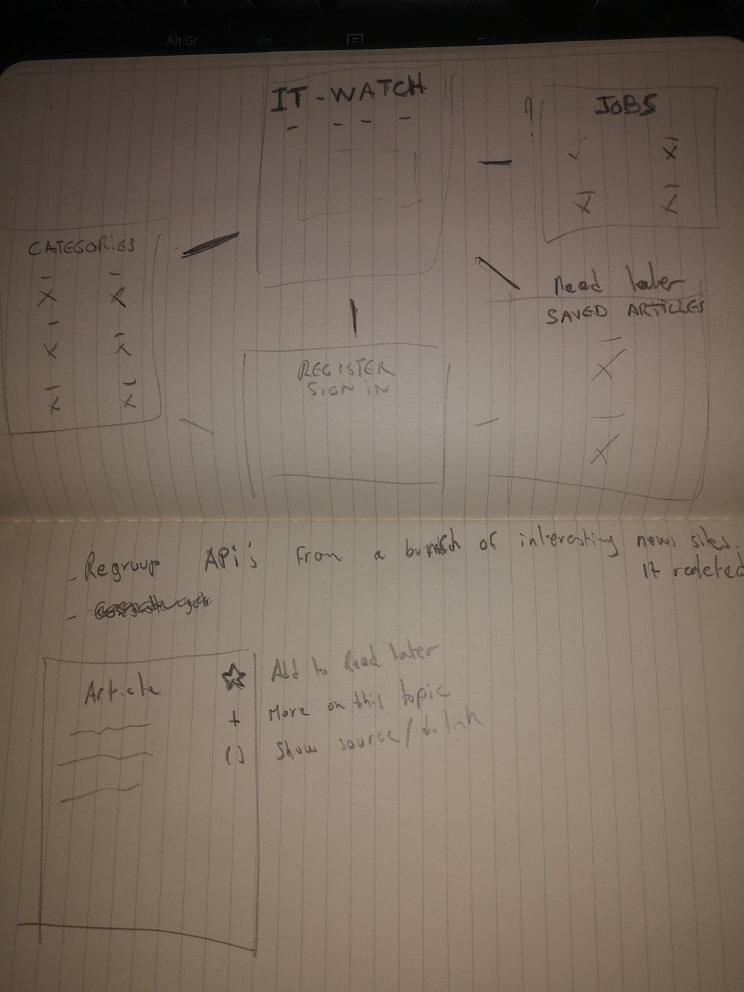

[npProject live link](https://mattnannetti.github.io/npProject/)

# npProject

- Repository: `OOP`
- Type de challenge:  `Consolidation`
- Durée: `4 semaines`
- Deadline: `16/11/20 9 A.M.`
- Déploiement :
	- Github page
	- Heroku
	- Heroku + remote DBA
	- self-hosting
	- ...
- Team challenge :  `solo`

## La Mission

Thème choisi:

Portail d'actualités

## Starting point

### Technos

**Back :** NodeJs

**Front :** ReactJs

**Database :** PostGreSQL

## Suivi du projet

## Ressources

