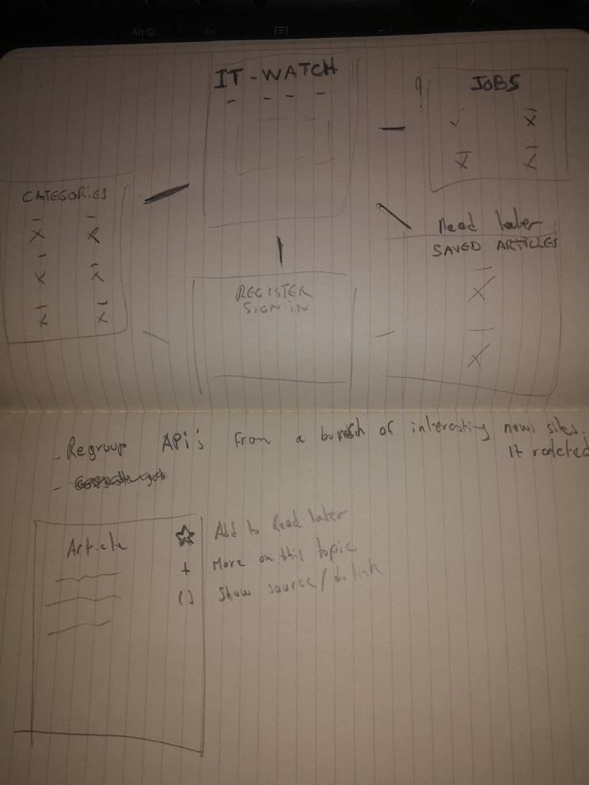
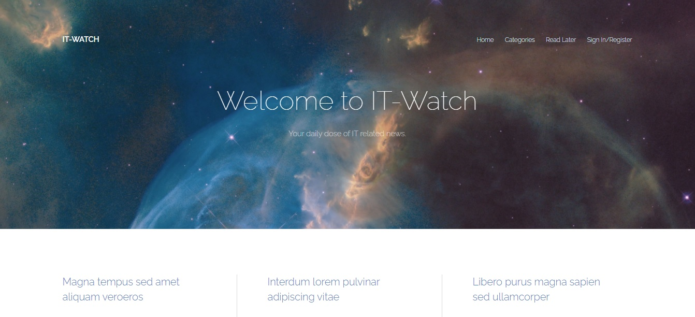
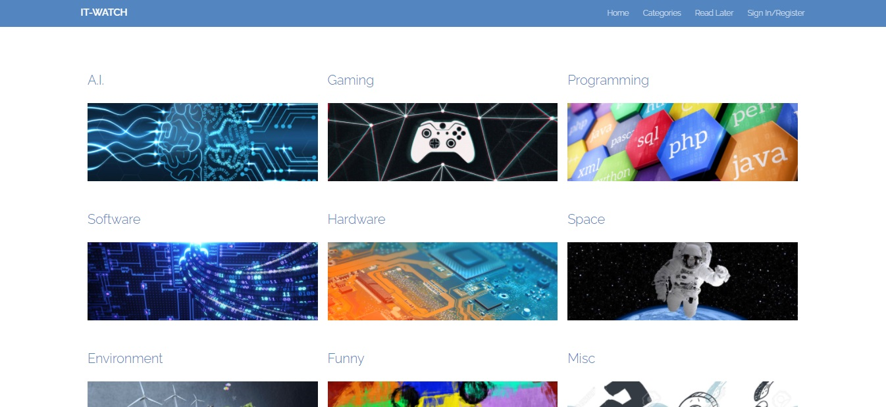

[npProject live link](https://mattnannetti.github.io/npProject/)

# npProject

- Repository: `OOP`
- Challenge type:  `Consolidation`
- Time: `4 weeks`
- Deadline: `16/11/20 9 A.M.`
- Deployment :
	- Github page
	- Heroku
	- Heroku + remote DBA
	- self-hosting
	- ...
- Team challenge :  `solo`

## Mission

Chosen theme:

IT related news website.
Regrouping APIs from major IT news canals and sorting them out.

## Starting point

### Tech

**Back :** NodeJs

**Front :** HTML/CSS

**Database :** MongoDB

## Following

- Sketches and sorting ideas

- Most of the front-end design and static pages

- NodeJS routes and server setup

- Implementing Front End into Node environment

- API setup (using NEWSAPI)

## Ressources

